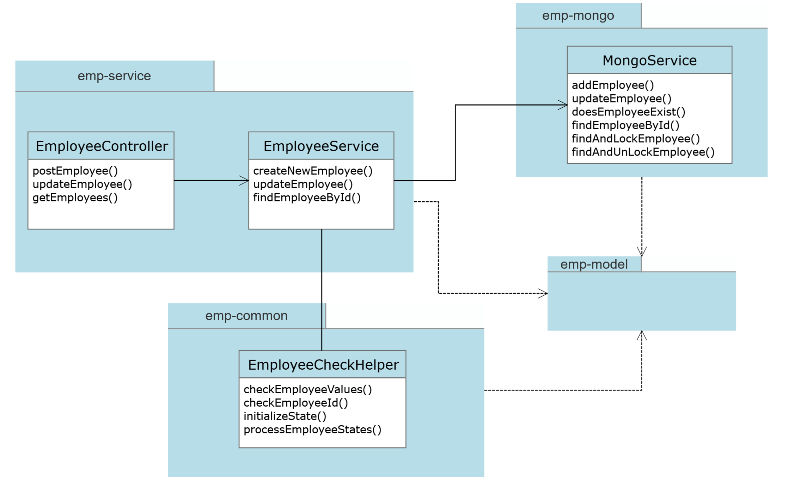

# Employee Management Platform (EMP) for WorkMotion

## Overview
The following repo contains a springboot app responsible for building emp platform for employees management system.

## Frameworks
The project is implemented using the following technologies

1. Java Version 11
2. Spring Boot Version 2.7.0
3. Mongo 4
4. OpenAPI 1.6.9

## Guidelines
Please follow the below steps to get the application up and running

1. Clone this repository
	```sh
    foo@bar:~$ git clone https://github.com/ailes17/emp.git
    ```
2. Build the code using maven command :
    ```sh
    foo@bar:~$ mvn clean package
    ```
3. Go to the root folder :
   ```sh
    foo@bar:~$ cd emp
    ```
4. Use docker-compose command line to start the containers :
    ```sh
    foo@bar:~$ docker-compose up
    ```
    There are two containers that will be started, one for SpringBoot API and another one for MongoDB
    
## Diagrams
### Class diagram



## Documentation
### Main endpoints
1. Create an Employee
> POST localhost:8080/workmotion/employee
2. Retrieve an Employee by ID 
> GET localhost:8080/workmotion/employee/{Id}
3. Retrieve all Employees
> GET localhost:8080/workmotion/employees
4. Update an Employee
> PUT localhost:8080/workmotion/employee

### Swagger detailed documentation
Swagger is automatically embedded to the API, the detailed documentation can be accessed from the link below (docker containers should be up and running in order to access Swagger) :
>[Swagger UI](http://localhost:8080/swagger-ui/index.html)