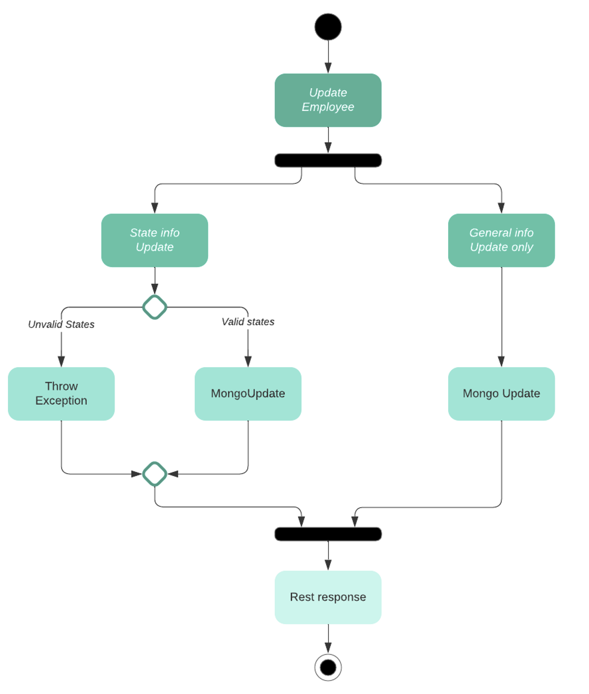

# Employee Management Platform (EMP) for WorkMotion

## Overview
The following repo contains a springboot app responsible for building emp platform for employees management system.

## Frameworks
The project is implemented using the following technologies

1. Java Version 11
2. Spring Boot Version 2.7.0
3. Mongo 4
4. OpenAPI 1.6.9

## Guidelines
Please follow the below steps to get the application up and running

1. Clone this repository
	```sh
    foo@bar:~$ git clone https://github.com/ailes17/emp.git
    ```
2. Build the code using maven command :
    ```sh
    foo@bar:~$ mvn clean package
    ```
3. Go to the root folder :
   ```sh
    foo@bar:~$ cd emp
    ```
4. Use docker-compose command line to start the containers :
    ```sh
    foo@bar:~$ docker-compose up
    ```
    There are two containers that will be started, one for SpringBoot API and another one for MongoDB
    
## Diagrams
### Class diagram


### "Update" Activity diagram


## Documentation
### Specifications
The specifications used for this project have been taken from the following sources : 
> [Guidelines](spec/GUIDELINES.md)

> [Challenge description (Senior)](spec/SENIOR_CHALLENGE.md)

> [Diagram](spec/senior_challenge_state_transition_diagram.png)

On top of the described functionalities, the following points have been added (assumed) :
* When a user is created, the global state and the substates are not enforced, those will be initialized to (respectively) : **ADDED**, **null** and **null**
	If different states are filled out, those will be overriden by the values listed above

* While in state : **IN_CHECK**, we are only permitting one substate change by update at a time, the substates SecurityCheck and WorkPermitCheck can not be modified both in the same update

* Once the employee is in **APPROVED** state, both substates with the finish status can not be modified anymore, only **ACTIVE** action is permitted

### Concurrency
Concurrency scenario where two users try to update, at the same time, an employee is handled as described below :

0. Employee entity in DB with the following states : (**IN_CHECK**, WORK_PERMIT_CHECK_STARTED, SECURITY_CHECK_STARTED)
1. User1 triggers an update : (**IN_CHECK**, WORK_PERMIT_CHECK_FINISHED, SECURITY_CHECK_STARTED)
2. Before the update starts, we fetch the entity from DB and we lock it with the status **PENDING**
3. Employee entity in DB is now : (**PENDING**, WORK_PERMIT_CHECK_STARTED, SECURITY_CHECK_STARTED)
4. User2 triggers at the same time an update : (**IN_CHECK**, WORK_PERMIT_CHECK_STARTED, SECURITY_CHECK_FINISHED)
5. While fetching the entity from DB, we check for the status, if it's pending, the call is rejected with 401 Unauthorized operation
6a. User1 finishes the update and now the states in DB are :  (**IN_CHECK**, WORK_PERMIT_CHECK_FINISHED, SECURITY_CHECK_STARTED)
6b. Error while updating the user (for example the states are not valid), and in this case we restore the previous state : (**IN_CHECK**, WORK_PERMIT_CHECK_STARTED, SECURITY_CHECK_STARTED)


### Main endpoints
1. Create an Employee
> POST localhost:8080/workmotion/employee
2. Retrieve an Employee by ID 
> GET localhost:8080/workmotion/employee/{Id}
3. Retrieve all Employees
> GET localhost:8080/workmotion/employees
4. Update an Employee
> PUT localhost:8080/workmotion/employee

### Possible Errors and return types

| Command | Response | Description
| --- | --- | --- |
| GET /employee/{id} | 200 | Returns the Employee |
| | 400 | Bad Request (eg: Employee Id can't be null or empty) |
| | 500 | Server Error, this case if any error while fetching from MongoDB |
| GET /employees | 200 | Returns List of employees |
| | 500 | Server Error, this case if any error while fetching from MongoDB |
| POST /employee/ | 201 | Created and Returns the Employee |
| | 409 | Conflict, Employee already exist |
| | 500 | Server Error, this case if any error while saving to MongoDB |
| PUT /employee | 200 | Returns the Employee updated |
| | 404 | Employee to update not found in DB |
| | 401 | Unauthorized, as another process might be updating the same Employee |
| | 500 | Server Error, this case if any error while saving to MongoDB |


### Swagger detailed documentation
Swagger is automatically embedded to the API, the detailed documentation can be accessed from the link below (docker containers should be up and running in order to access Swagger) :
>[Swagger UI](http://localhost:8080/swagger-ui/index.html)